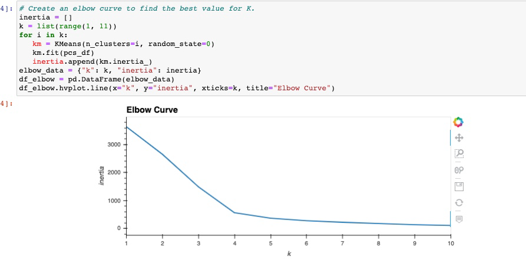
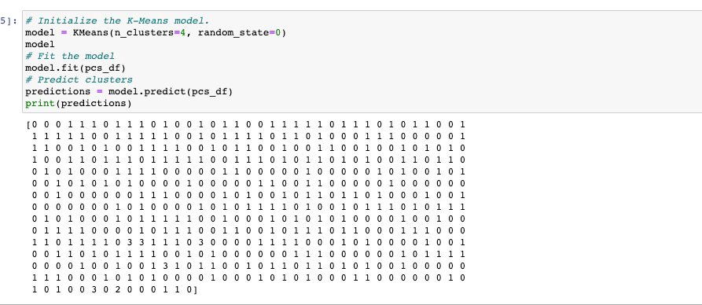
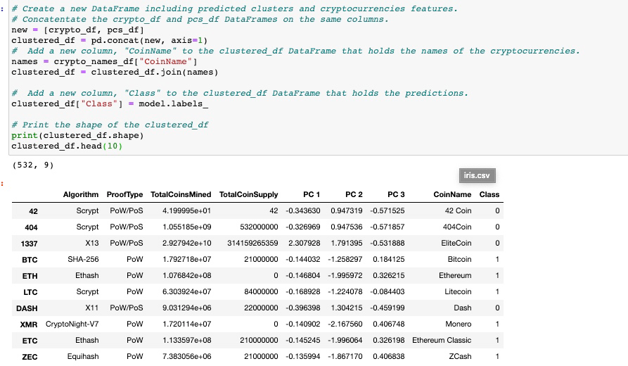
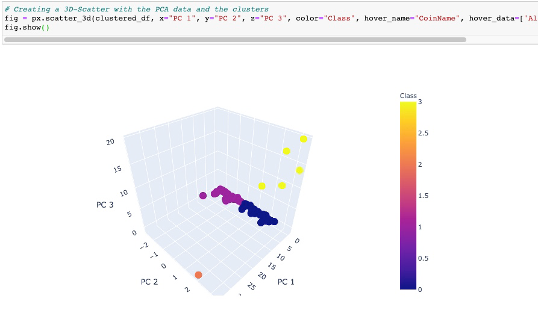
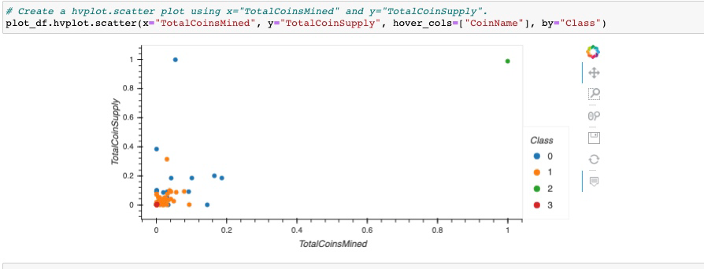

# Cryptocurrencies
This repository was create to share results of an analysis of crytocurrency data. The provided dataset included various cryptocurrencies available, algorithms, proof types, coins mined, and coin supply. 
- The data was preprocessed so remaining cryptocurrencies are currently traded, has complete data, and have a working algorithm. 
- String values for Algorithm and ProofType were converted to integers (get_dummies) and data was scaled (fit_transform) to support further analysis with machine learning.
- Principal Component Analysis (PCA) algorithm was utilized to reduce the dimensions to three principal components. 
- An elbow curve was generated to identify the best value for K.

- The K-means algorithm was run to predict K clusters

- The original dataframe was combined with the principal components to form a new dataframe

- A 3-dimensional scatter plot was generated to visualize the three K clusters

- A scatter plot was created to visualize the distribution of scaled (MinMaxScaler) TotalCoinSupply and TotalCoinsMined values

